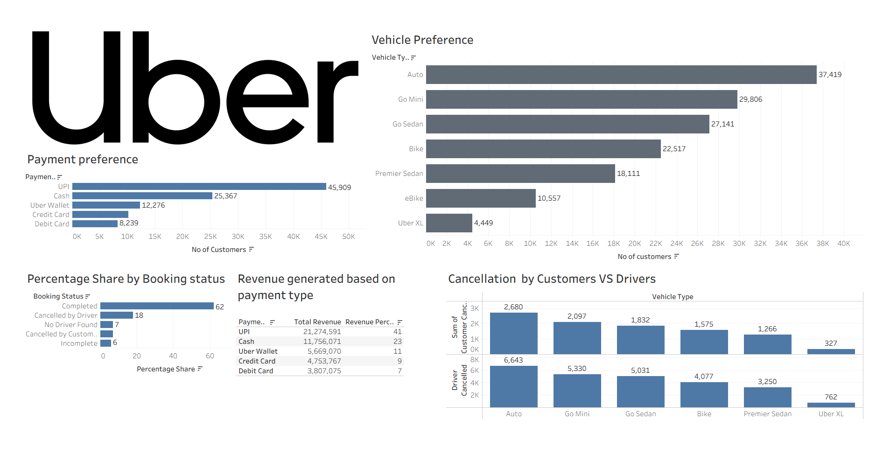

# SQL_Uber_Analytics_Project
# 🚖 Uber NCR Ride Bookings — SQL Analytics Project



---

## 📌 Project Overview

This end-to-end data analytics project analyzes Uber ride bookings in the NCR (National Capital Region). Starting from raw Excel data, the workflow covers data import, cleaning, SQL-based analysis, and Tableau visualization.

**Workflow:**
```
Raw Excel Data (ncr_ride_bookings.csv)
        ↓
   Import into SQL
        ↓
   Data Cleaning
        ↓
  SQL Analysis (7 Business Questions)
        ↓
  Export Tables → Uber_SQL_Tables.xlsx
        ↓
  Tableau Dashboard (Uber Dashboard.twbx)
```

---

## 📁 Repository Structure

| File | Description |
|------|-------------|
| `ncr_ride_bookings.csv` | Raw source data |
| `SQL.txt` | Full SQL script — cleaning + analysis |
| `Uber_SQL_Tables.xlsx` | Exported query results from SQL |
| `Uber Dashboard.twbx` | Tableau workbook with interactive dashboard |
| `Uber.png` | Dashboard screenshot |

---

## 🛠️ Tools Used

- **SQL** — Data cleaning & analysis
- **Excel** — Raw data source & exported results
- **Tableau** — Dashboard & visualization

---

## 🔍 SQL Analysis — Business Questions

### Q1. How many unique customers use each payment method?

```sql
SELECT payment_method, COUNT(DISTINCT customer_id) AS No_of_Customers
FROM ncr_ride_bookings
GROUP BY payment_method
ORDER BY No_of_Customers DESC;
```
> Identifies the most popular payment methods among customers.

---

### Q2. Customer distribution by vehicle type

```sql
SELECT vehicle_type, COUNT(DISTINCT customer_id) AS No_of_customers
FROM ride_bookings
GROUP BY vehicle_type
ORDER BY No_of_customers DESC;
```
> Shows which vehicle types attract the most unique customers.

---

### Q3. How many cancellations are initiated by customers vs drivers for each vehicle type?

```sql
SELECT vehicle_type,
       SUM(cancelled_rides_by_customer) AS customer_cancelled,
       SUM(cancelled_rides_by_driver)   AS driver_cancelled
FROM ride_bookings
GROUP BY vehicle_type
ORDER BY vehicle_type DESC;
```
> Breaks down cancellation responsibility by vehicle category.

---

### Q4. What is the total number of customer-initiated vs driver-initiated cancellations across all rides?

```sql
SELECT SUM(cancelled_rides_by_customer) AS customer_cancelled,
       SUM(cancelled_rides_by_driver)   AS driver_cancelled
FROM ride_bookings;
```
> Platform-wide view of cancellation patterns.

---

### Q5. What is the average booking value by vehicle type?

```sql
SELECT vehicle_type,
       ROUND(AVG(booking_value), 2) AS avg_booking_value
FROM ride_bookings
WHERE booking_status = 'Completed'
GROUP BY vehicle_type
ORDER BY avg_booking_value DESC;
```
> Compares revenue per ride across different vehicle types (completed rides only).

---

### Q6. What is the distribution of booking outcomes across the platform?

```sql
SELECT booking_status,
       COUNT(*) AS total_bookings,
       ROUND(COUNT(*) * 100.0 / SUM(COUNT(*)) OVER (), 0) AS percentage_share
FROM ride_bookings
GROUP BY booking_status
ORDER BY total_bookings DESC;
```
> Shows what proportion of rides are completed, cancelled, or otherwise.

---

### Q7. Revenue distribution by payment method for completed rides

```sql
SELECT payment_method,
       SUM(booking_value) AS total_revenue,
       ROUND(SUM(booking_value) / (
           SELECT SUM(booking_value)
           FROM ride_bookings
           WHERE booking_status = 'completed'
       ) * 100, 2) AS revenue_percentage
FROM ride_bookings
WHERE booking_status = 'completed'
GROUP BY payment_method
ORDER BY total_revenue DESC;
```
> Reveals which payment methods drive the most revenue on the platform.

---

## 📊 Tableau Dashboard

The query results exported to `Uber_SQL_Tables.xlsx` were connected to Tableau to build an interactive dashboard covering ride trends, cancellation analysis, revenue breakdown, and customer behavior.

Open `Uber Dashboard.twbx` in Tableau Desktop to explore the full dashboard.

---

## 🚀 How to Reproduce

1. Import `ncr_ride_bookings.csv` into your SQL environment
2. Run the scripts in `SQL.txt` (data cleaning first, then analysis queries)
3. Export results and open `Uber_SQL_Tables.xlsx` to verify outputs
4. Open `Uber Dashboard.twbx` in Tableau to view the dashboard
